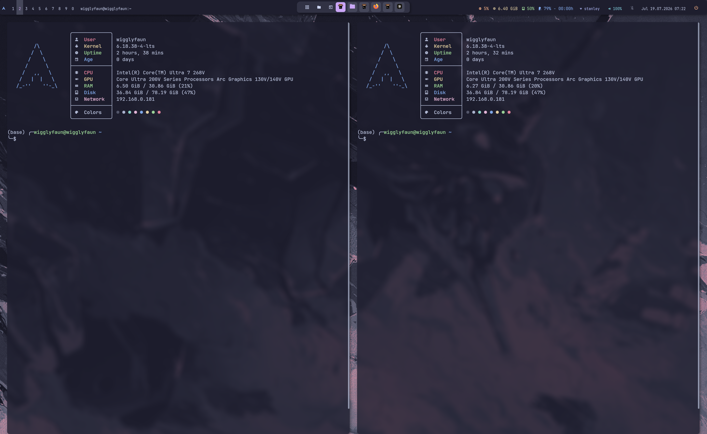

# Awesome WM + Catppuccin Desktop



One-shot installer for **Awesome WM + Catppuccin Mocha** on Arch Linux.

Inspired by [Catppuccin on Arch (Reddit)](https://www.reddit.com/r/linux4noobs/comments/1f4k0wj/catppuccin_arch_linux_theme/) and customized with:

- Catppuccin Mocha palette across Awesome, Polybar, Rofi, Kitty, Dunst, GTK
- Custom center **taskbar pill** (pinned apps + open windows)
- **Polybar** top bar: menu, workspaces, system info, volume slider, WiFi, Bluetooth, power
- **Picom** blur and rounded corners
- **PipeWire** audio setup
- **feh** wallpapers

## Quick start

```bash
git clone https://github.com/NutanPanta/awesome-catppuccin-desktop.git
cd awesome-catppuccin-desktop
chmod +x install.sh
./install.sh
```

Log out and back in, then choose **Awesome** at the login screen.

## What `install.sh` does

1. Installs packages from `packages.txt` via `pacman`
2. Backs up any existing configs to `~/.config-backups/<timestamp>/`
3. Copies configs into `~/.config/` (awesome, polybar, rofi, picom, kitty, dunst, gtk, wallpapers, wireplumber)
4. Installs `~/.fehbg` for the default wallpaper
5. Applies the WirePlumber audio profile and restarts PipeWire user services

### Options

| Flag | Effect |
|------|--------|
| `./install.sh` | Full install (packages + configs) |
| `./install.sh --config-only` | Skip pacman, only deploy configs |
| `./install.sh --dry-run` | Print actions without changing anything |
| `./install.sh --help` | Show help |

## Repo layout

```
.
├── install.sh           # Main installer, run this
├── packages.txt         # Arch pacman packages
├── fehbg                # Wallpaper script to ~/.fehbg
├── assets/desktop.png   # Screenshot for README
└── config/
    ├── awesome/         # rc.lua, autostart, theme, taskbar pill, volume OSD
    ├── polybar/         # Top bar + scripts
    ├── rofi/            # Launcher + powermenu + wallpaper picker
    ├── picom/           # Compositor
    ├── kitty/           # Terminal colors
    ├── dunst/           # Notifications
    ├── gtk-3.0/         # GTK theme hints
    ├── gtk-4.0/
    ├── wireplumber/     # WirePlumber profile
    └── wallpapers/      # Default Catppuccin wallpapers
```

## After install

| Task | Command |
|------|---------|
| Fix audio | `bash ~/.config/awesome/fix-audio.sh` |
| Reload Awesome | `Super+Ctrl+r` |
| Reload polybar | `polybar-msg cmd restart` |
| Change wallpaper | `Super+w` (rofi picker) |
| Powermenu | Polybar power icon (click) |

## Keybindings (default)

| Keys | Action |
|------|---------|
| `Super+Enter` | Kitty terminal |
| `Super+p` | Rofi app launcher |
| `Super+d` | Calculator |
| `Super+w` | Wallpaper picker |
| `Print` | Flameshot |
| `Super+1-9` | Switch workspace / tag |
| `Super+Shift+c` | Close focused window |

## Requirements

- Arch Linux (or Arch-based with `pacman`)
- Awesome WM session (display manager or `~/.xinitrc`)

## License

Config files are personal dotfiles. Use and modify freely. Third-party scripts in `rofi/scripts/` may carry their own licenses (see file headers).
